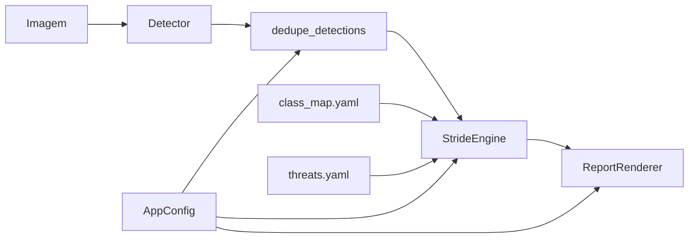

# STRIDE Report Fidelity — Design

**Spec**: `.specs/features/stride-report-fidelity/spec.md`
**Status**: Approved (usuário pediu implementação)

---

## Architecture Overview

Evolução do pipeline existente (AD-001, AD-007). Sem LLM. Três eixos:

1. **Semântica** — realocar labels no `class_map.yaml` + novas famílias/entradas na KB + papel `scope`
2. **Dedupe espacial** — função pura pós-detecção, pré-engine
3. **Confiança** — limiar configurável + coluna/flag no relatório



Conformidade com decisões ativas: AD-001 (determinístico), AD-007 (roles/inventário/coverage) — estendido, não supersedido. Novo AD-008 registra famílias + papel `scope` + limiares.

---

## Code Reuse Analysis

| Component | Location | How to Use |
| --------- | -------- | ---------- |
| ClassFamilyMapper | `src/stride_mvp/data/class_map.py` | Sem mudança de API; só YAML |
| ThreatKB.role/lookup | `src/stride_mvp/stride/kb.py` | Role `scope` via `roles:` no YAML; loader intacto |
| StrideEngine | `src/stride_mvp/stride/engine.py` | Branch para `role == "scope"`; anexar confiança |
| ReportRenderer | `src/stride_mvp/stride/report.py` | Coluna confiança; pular detalhe de `scope` |
| AppConfig / load_config | `src/stride_mvp/config.py` | Mesmo padrão walrus env de `STRIDE_MIN_COVERAGE` |
| run_pipeline | `src/stride_mvp/pipeline/run.py` | Chamar dedupe antes do analyze |
| ScriptedDetector pattern | `tests/integration/test_e2e_pipeline.py` | Cenários REG-01/02 |

---

## Components

### 1. Class map reallocations

- **Location**: `data/class_map.yaml`
- **Change**: mover labels para famílias novas:
  - `filesystem`: `efs`, `aws_elactic_file_system(nfs)_multi-az`
  - `backup`: `backup`, `aws_backup`
  - `email`: `aws_simple_email_service` (+ alias `ses`)
  - `scaling`: `auto_scaling`, `auto_scaling_group`, `aws_autoscaling`, `aws_amazon_ec2_auto_scaling`
  - `integration`: `logic_apps`, `azure_logic_apps`
  - `dependency`: `sass_services`, `azure_services`
  - `management`: `resource_group`, `azure_resource_groups`, `aws_cloud`, `aws_region`

### 2. KB entries + roles

- **Location**: `data/kb/threats.yaml`
- **Roles**: `backup`/`scaling` → control; `dependency` → external; `management` → scope; `filesystem`/`email`/`integration` → workload (default)
- **Entries**: textos com termos obrigatórios/proibidos da spec (SEM/AZR)
- **Scope**: sem entradas KB; consistência map↔KB isenta famílias com role `scope`

### 3. Spatial dedupe

- **Location**: `src/stride_mvp/detection/dedupe.py` (novo)
- **Interfaces**:
  - `iou(a, b) -> float`
  - `containment(inner, outer) -> float` (área de interseção / área de inner)
  - `dedupe_detections(dets, *, iou_threshold: float) -> tuple[list[Detection], int]` — retorna sobreviventes + nº removidos; threshold 0 → no-op
- **Algoritmo**: ordenar por confiança desc; greedy NMS intra-classe (nome normalizado via `_normalize` + `_strip_vendor`); remoção se IoU ≥ limiar OU contenção ≥ 0.8

### 4. Config

- **Fields**: `dedupe_iou: float = 0.5`, `low_conf: float = 0.50`
- **Env**: `STRIDE_DEDUPE_IOU`, `STRIDE_LOW_CONF`
- **Validation**: valores fora de [0, 1] → `ValueError` com mensagem acionável

### 5. Models / Engine

- **ThreatFinding**: campos aditivos `max_confidence: float | None = None`, `low_confidence: bool = False`
- **Engine**: se `role == "scope"` → emitir 1 finding marcador (`stride_category="Escopo"`, textos de inventário de escopo, `mapped=True`) e contar em `mapped_instances`; senão comportamento atual + preencher confiança a partir do max do grupo
- **low_conf threshold**: parâmetro opcional `low_conf: float = 0.5` em `analyze`

### 6. Pipeline

- Após `predict`, chamar `dedupe_detections(..., iou_threshold=config.dedupe_iou)`; se removidas > 0, append note
- Passar `low_conf=config.low_conf` ao engine

### 7. Report

- Sumário: coluna **Confiança** (`max_confidence` formatado `.2f` ou `—`); sufixo ` ⚠` no componente se `low_confidence`
- Findings com `role == "scope"` entram no sumário, **não** nas seções de ameaça/controle/zona/inventário
- Nota global se algum `low_confidence` (texto sobre falso positivo / base de treino)
- JSON: `max_confidence`, `low_confidence` por finding

---

## Data Models

```python
# ThreatFinding — campos novos (aditivos)
max_confidence: float | None = None
low_confidence: bool = False

# AppConfig — campos novos
dedupe_iou: float = 0.5
low_conf: float = 0.50
```

---

## Error Handling Strategy

| Scenario | Handling | User impact |
| -------- | -------- | ----------- |
| `STRIDE_DEDUPE_IOU` / `STRIDE_LOW_CONF` fora de [0,1] ou não numérico | `ValueError` em `load_config` | CLI falha com mensagem clara |
| Dedupe remove N caixas | Note no relatório | Transparência |
| Só componentes `scope` | coverage=1.0, só sumário | Relatório limpo |

---

## Risks & Concerns

| Concern | Location | Impact | Mitigation |
| ------- | -------- | ------ | ---------- |
| `test_every_class_map_family_has_kb_entry` quebra com `management` sem KB | `tests/unit/test_kb.py` | CI vermelho | Isentar role `scope` no teste (SEM-06) |
| AWS e2e espera `auto_scaling` como workload implícito | `test_e2e_pipeline.py` | Role muda para control | Teste só checa controles explícitos; coverage ainda ≥0.9 |
| Dedupe agressivo remove instâncias legítimas próximas | novo `dedupe.py` | Subcontagem | Limiar 0.5 + DED-03 (disjuntas preservadas); env=0 desliga |
| Detector Azure continua fraco | fora de escopo | Falsos positivos residuais | CONF-02 + feature futura `detector-azure-robustness` |

---

## Tech Decisions

| Decision | Choice | Rationale |
| -------- | ------ | --------- |
| Escopo no relatório | Finding marcador `role=scope` / `stride_category=Escopo` | Reusa sumário existente sem novo campo em ThreatReport |
| Onde vive dedupe | `detection/dedupe.py` + chamada no pipeline | Testável sem YOLO; ScriptedDetector também se beneficia |
| Família `management` para escopos | Uma família, role `scope` | Uma isenção de KB; labels distintos |
| AD-008 | Registrar famílias + limiares + papel scope | Continuidade do log de decisões |
