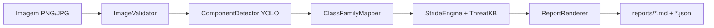
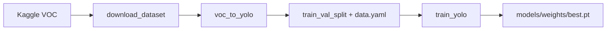

# STRIDE Threat Modeling MVP — Design

**Spec**: `.specs/features/stride-threat-modeling-mvp/spec.md`  
**Context**: `.specs/features/stride-threat-modeling-mvp/context.md`  
**Status**: Draft (recomendações travadas por AD-001…AD-003 + decisão de stack abaixo)

---

## Approach Exploration (Complex)

| Approach | Resumo | Prós | Contras |
| -------- | ------ | ---- | ------- |
| **A — Monólito Python + Ultralytics YOLO + CLI** ⭐ | Package `stride_mvp`: dataset tooling → treino/inferência YOLO → KB YAML → relatório MD; entrada via CLI | Simples de demo/reproduzir; alinhado a Kaggle VOC→YOLO; um repo só | UI web fica P2 |
| B — FastAPI + treino separado | API HTTP desde o dia 1; workers de treino à parte | Bom para UI; contratos HTTP claros | Mais ceremony para MVP acadêmico |
| C — Notebooks-first | Jupyter para treino/demo; scripts finos | Rápido para explorar | Frágil para testes/CLI/entrega |

**Escolha:** Approach **A**. UI (P2) pode ser Gradio/FastAPI fino sobre o mesmo `Pipeline`.

---

## Architecture Overview

Pipeline linear: imagem → validação → detector YOLO → mapa classe→família → motor STRIDE+KB → relatório Markdown (e JSON).



Treino (offline):



---

## Code Reuse Analysis

### Existing Components to Leverage

| Component | Location | How to Use |
| --------- | -------- | ---------- |
| — | Repo greenfield | Nenhum código de aplicação ainda; reutilizar apenas skills/specs |

### External libraries (reuse instead of reinvent)

| Library | Role |
| ------- | ---- |
| `ultralytics` | Treino + inferência YOLO (NMS incluso) |
| `opencv-python` / Pillow | I/O de imagem, validação |
| `PyYAML` | KB + class map + data.yaml |
| `typer` ou `argparse` | CLI |
| `pytest` | Testes unitários/integração |
| `kaggle` (CLI/API) | Download do dataset (documentado; não embutir secrets) |

### Integration Points

| System | Integration Method |
| ------ | ------------------ |
| Kaggle dataset | Script `download_dataset.py` + docs; dados em `data/raw/` (gitignored) |
| Arquiteturas 1–2 | `data/eval/` versionado (imagens + labels YOLO) |
| Artefatos de modelo | `models/weights/` gitignored; README aponta como treinar ou baixar checkpoint demo |

---

## Repository Layout

```
.
├── pyproject.toml
├── README.md
├── .gitignore
├── src/stride_mvp/
│   ├── __init__.py
│   ├── config.py
│   ├── models.py              # Detection, ThreatFinding, ThreatReport
│   ├── data/
│   │   ├── download.py
│   │   ├── voc_to_yolo.py
│   │   ├── split.py
│   │   └── class_map.py
│   ├── detection/
│   │   ├── train.py
│   │   └── detector.py
│   ├── stride/
│   │   ├── kb.py
│   │   ├── engine.py
│   │   └── report.py
│   ├── pipeline/
│   │   ├── validate.py
│   │   └── run.py
│   └── cli.py
├── data/
│   ├── raw/                   # gitignore — Kaggle
│   ├── processed/             # YOLO labels (gitignore imagens grandes)
│   ├── eval/                  # arch1/arch2 + labels
│   ├── class_map.yaml
│   └── kb/threats.yaml
├── models/weights/            # gitignore *.pt
├── reports/
├── docs/fluxo-desenvolvimento.md
└── tests/
    ├── unit/
    └── integration/
```

---

## Components

### Config

- **Purpose**: Paths, limiar de confiança, tamanho máx. de imagem, idioma.
- **Location**: `src/stride_mvp/config.py`
- **Interfaces**:
  - `load_config(path: Path | None = None) -> AppConfig`
- **Dependencies**: env vars opcionais (`STRIDE_MODEL_PATH`, `STRIDE_CONF`)
- **Reuses**: — 

### Domain Models

- **Purpose**: Contratos tipados entre detecção, STRIDE e relatório.
- **Location**: `src/stride_mvp/models.py`
- **Interfaces**: dataclasses/`TypedDict` — `Detection`, `ThreatFinding`, `ThreatReport`
- **Dependencies**: stdlib
- **Reuses**: —

### DatasetDownloader

- **Purpose**: Documentar/automatizar obtenção do Kaggle `carlosrian/software-architecture-dataset`.
- **Location**: `src/stride_mvp/data/download.py`
- **Interfaces**:
  - `ensure_dataset(dest: Path) -> Path` — falha com mensagem se Kaggle não configurado
- **Dependencies**: Kaggle CLI/API (opcional em runtime de inferência)
- **Reuses**: AD-003

### VocToYoloConverter

- **Purpose**: Converter Pascal VOC XML → labels YOLO + lista de classes.
- **Location**: `src/stride_mvp/data/voc_to_yolo.py`
- **Interfaces**:
  - `convert_voc_dir(voc_root: Path, out_root: Path, class_names: list[str]) -> ConvertStats`
- **Dependencies**: XML parser, Pillow (dims da imagem)
- **Reuses**: formato Ultralytics (`class x_c y_c w h` normalizado)

### ClassFamilyMapper

- **Purpose**: Mapear classe Kaggle (~87) → família STRIDE (`database`, `compute`, `api`, …).
- **Location**: `src/stride_mvp/data/class_map.py` + `data/class_map.yaml`
- **Interfaces**:
  - `load_class_map(path: Path) -> ClassMap`
  - `to_family(class_name: str) -> str` — fallback `unknown`
- **Dependencies**: PyYAML
- **Reuses**: —

### TrainValSplit + data.yaml

- **Purpose**: Gerar split e `data.yaml` para Ultralytics.
- **Location**: `src/stride_mvp/data/split.py`
- **Interfaces**:
  - `write_split(processed_root: Path, val_ratio: float, seed: int) -> Path`  # retorna path do data.yaml
- **Dependencies**: —
- **Reuses**: convenção Ultralytics `path/train/val/names`

### Trainer

- **Purpose**: Treinar YOLO e persistir pesos + metadados.
- **Location**: `src/stride_mvp/detection/train.py`
- **Interfaces**:
  - `train(data_yaml: Path, epochs: int, imgsz: int, project: Path) -> Path`  # path best.pt
- **Dependencies**: `ultralytics`
- **Reuses**: `YOLO("yolo11n.pt")` (ou equivalente estável documentado)

### ComponentDetector

- **Purpose**: Inferência: imagem → lista de `Detection` (classe, confiança, bbox) com limiar.
- **Location**: `src/stride_mvp/detection/detector.py`
- **Interfaces**:
  - `ComponentDetector(weights: Path, conf: float)`
  - `predict(image_path: Path) -> list[Detection]`
- **Dependencies**: ultralytics (NMS nativo)
- **Reuses**: Trainer weights

### ThreatKB

- **Purpose**: KB versionada: família + categoria STRIDE → ameaça, vulnerabilidade, contramedida.
- **Location**: `src/stride_mvp/stride/kb.py` + `data/kb/threats.yaml`
- **Interfaces**:
  - `ThreatKB.load(path: Path) -> ThreatKB`
  - `lookup(family: str, category: str) -> list[ThreatFinding]`
  - `fallback(family: str) -> list[ThreatFinding]`  # genérico documentado
- **Dependencies**: PyYAML
- **Reuses**: —

### StrideEngine

- **Purpose**: Para cada detecção, aplicar categorias STRIDE aplicáveis à família e enriquecer via KB.
- **Location**: `src/stride_mvp/stride/engine.py`
- **Interfaces**:
  - `analyze(detections: list[Detection], mapper: ClassFamilyMapper, kb: ThreatKB) -> ThreatReport`
- **Dependencies**: ThreatKB, ClassFamilyMapper
- **Reuses**: —

### ReportRenderer

- **Purpose**: Emitir Markdown (pt-BR) e JSON estruturado.
- **Location**: `src/stride_mvp/stride/report.py`
- **Interfaces**:
  - `to_markdown(report: ThreatReport) -> str`
  - `to_json(report: ThreatReport) -> str`
  - `write(report: ThreatReport, out_dir: Path, stem: str) -> tuple[Path, Path]`
- **Dependencies**: —
- **Reuses**: —

### ImageValidator

- **Purpose**: Validar existência, formato PNG/JPG, não-vazio, tamanho máximo.
- **Location**: `src/stride_mvp/pipeline/validate.py`
- **Interfaces**:
  - `validate_image(path: Path, max_bytes: int) -> None`  # raises `ValidationError`
- **Dependencies**: Pillow
- **Reuses**: —

### Pipeline

- **Purpose**: Orquestrar ponta a ponta imagem → relatório.
- **Location**: `src/stride_mvp/pipeline/run.py`
- **Interfaces**:
  - `run_pipeline(image: Path, out_dir: Path, cfg: AppConfig) -> ThreatReport`
- **Dependencies**: Validator, Detector, Mapper, Engine, Renderer
- **Reuses**: —

### CLI

- **Purpose**: Entrypoint `stride-mvp analyze|train|prepare-data|eval`.
- **Location**: `src/stride_mvp/cli.py`
- **Interfaces**: Typer commands; exit code ≠ 0 em erro
- **Dependencies**: Pipeline, Trainer, dataset tools
- **Reuses**: —

### Docs (P2)

- **Purpose**: Fluxo de desenvolvimento + reprodução da demo.
- **Location**: `README.md`, `docs/fluxo-desenvolvimento.md`
- **Interfaces**: N/A (conteúdo)
- **Dependencies**: —
- **Reuses**: —

### Web UI mínima (P2, opcional)

- **Purpose**: Upload + exibir Markdown.
- **Location**: `src/stride_mvp/web/app.py` (Gradio ou FastAPI+HTML simples)
- **Interfaces**: `create_app() -> app` chamando `run_pipeline`
- **Dependencies**: Pipeline
- **Reuses**: —

### Metrics (P3)

- **Purpose**: mAP/métrica agregada no val split.
- **Location**: `src/stride_mvp/detection/eval_metrics.py`
- **Interfaces**:
  - `evaluate(weights: Path, data_yaml: Path) -> MetricsResult`  # persiste JSON/CSV
- **Dependencies**: ultralytics `model.val()`
- **Reuses**: Trainer

---

## Data Models

### Detection

```python
@dataclass
class Detection:
    class_name: str
    confidence: float
    bbox_xyxy: tuple[float, float, float, float]  # pixels
    family: str | None = None  # preenchido após ClassFamilyMapper
```

### ThreatFinding

```python
@dataclass
class ThreatFinding:
    component_class: str
    family: str
    stride_category: str  # S|T|R|I|D|E nomes completos pt/en documentados
    threat_description: str
    vulnerability_example: str
    countermeasure: str
    mapped: bool  # False se fallback / sem mapeamento
```

### ThreatReport

```python
@dataclass
class ThreatReport:
    source_image: str
    detections: list[Detection]
    findings: list[ThreatFinding]
    notes: list[str]  # ex.: zero detecções, classes unknown
```

### ClassMap (YAML)

```yaml
families:
  database: [rds, dynamodb, sql_database, ...]
  compute: [ec2, lambda, aks_node, ...]
  # ...
default_family: unknown
```

### Threat KB (YAML)

```yaml
entries:
  - family: database
    stride: Information Disclosure
    threat: "Exposição de dados em repouso/trânsito"
    vulnerability: "Bucket/DB sem criptografia / ACL pública"
    countermeasure: "Criptografia at-rest, least privilege, private endpoints"
fallback:
  threat: "Ameaça genérica para componente sem mapeamento específico"
  vulnerability: "Superfície de ataque não catalogada na KB"
  countermeasure: "Revisar controles de autenticação, autorização, logging e exposição de rede"
```

**Relationships**: `Detection.class_name` → `ClassMap` → `family` → `ThreatKB(family, stride_category)` → `ThreatFinding` ⊂ `ThreatReport`.

---

## Error Handling Strategy

| Error Scenario | Handling | User Impact |
| -------------- | -------- | ----------- |
| Imagem inválida / formato / tamanho | `ValidationError`; CLI exit 1 | Mensagem clara, sem relatório |
| Zero detecções acima do limiar | Report com `notes` + findings vazios | Aviso explícito; sem ameaças inventadas |
| Classe fora do mapa | `family=unknown` + fallback KB | Finding marcado `mapped=False` |
| KB incompleta para família | Fallback genérico por categoria aplicável | Finding com nota de fallback |
| Pesos ausentes | Erro na carga do detector | Instrução para treinar/baixar |
| Kaggle não autenticado | Erro no download com link de setup | Docs apontam `kaggle.json` |
| Falha de treino interrompida | Não promover `best.pt` sem corrida completa | Docs: artefato parcial ≠ modelo pronto |

---

## Risks & Concerns

| Concern | Location | Impact | Mitigation |
| ------- | -------- | ------ | ---------- |
| Repo greenfield — zero código/testes | `/workspace` | Tudo a criar; risco de overbuild | Approach A; fases atômicas; pytest desde a fundação |
| Dataset Kaggle ~8k binários | externo | Repo inchado / CI lento | `data/raw/` gitignored; script de download; subset opcional para smoke train |
| ~87 classes cloud ≠ ícones das Figuras 1–2 | domínio | Baixa recall na eval do hackathon | `data/eval/` anotado; fine-tune curto ou few images; mapa de famílias |
| Domínio shift (ícones AWS vs diagramas genéricos do PDF) | detector | Demo fraca nas arquiteturas de teste | Incluir diagramas estilo enunciado no treino/finetune; documentar limitação |
| Sem GPU no ambiente de demo | treino | Treino longo | Preferir `yolo11n`; checkpoint demo documentado; treino em Colab/Kaggle opcional nos docs |
| Secrets Kaggle | download | Vazamento de API key | Nunca commitir `kaggle.json`; só docs |
| LLM opcional | report | Não bloqueante | Fora do caminho crítico; não implementar no P1 |

---

## Tech Decisions (feature-local + project-level)

| Decision | Choice | Rationale |
| -------- | ------ | --------- |
| Stack de detecção | Ultralytics YOLO11n (nano) como default | Rápido de treinar/inferir; NMS built-in; VOC→YOLO bem suportado |
| Linguagem | Python 3.11+ | Ecossistema CV/ML |
| Empacotamento | `src/stride_mvp` + `pyproject.toml` | Layout moderno, testável |
| CLI | Typer | UX clara para `analyze`/`train` |
| KB / class map | YAML no repo | Versionável, auditável (KB-03) |
| Relatório P1 | Markdown + JSON | Legível + testável |
| Testes | pytest (`tests/unit`, `tests/integration`) | Strong default; repo sem testes prévios |
| UI P2 | Gradio fino sobre Pipeline | Menos código que FastAPI+frontend |
| LLM | Não no P1 | AD-001 |

**Project-level → STATE.md:** AD-004 (Ultralytics YOLO), AD-005 (Python package + pytest).

---

## Requirement → Component Map

| Requirement | Component(s) |
| ----------- | ------------ |
| DATA-01 | DatasetDownloader |
| DATA-02 | VocToYoloConverter, ClassFamilyMapper |
| DATA-03 | `data/eval/` + docs |
| DET-01 | Trainer |
| DET-02, DET-03 | ComponentDetector |
| DET-04 | Pipeline + eval samples |
| STRIDE-01..04 | StrideEngine, ReportRenderer |
| KB-01..04 | ThreatKB + YAML |
| PIPE-01..04 | Pipeline, ImageValidator, CLI |
| DOC-01..02 | README + docs |
| UI-01..02 | Web UI (P2) |
| MET-01..02 | eval_metrics (P3) |
